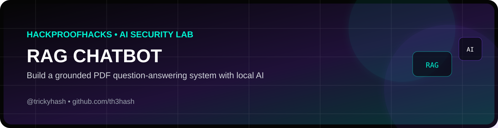
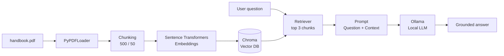
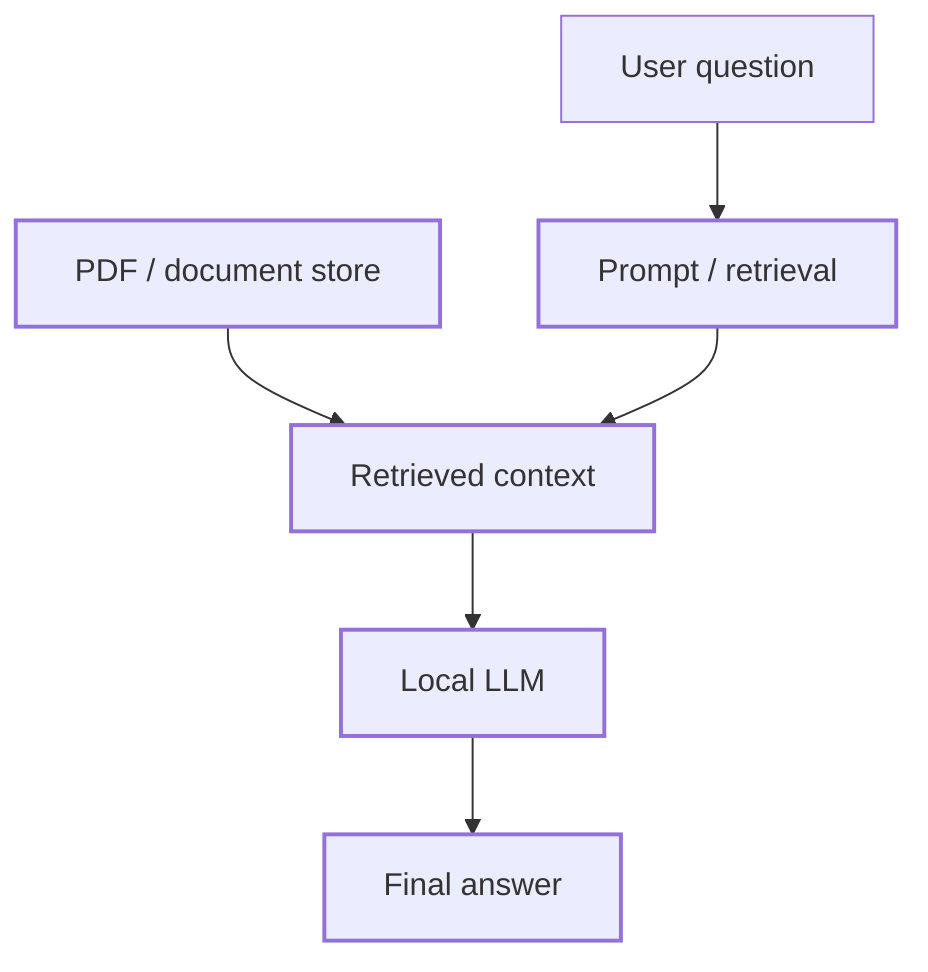

<p align="center"></p>

# RAG Chatbot — Local PDF Question Answering

A local **Retrieval-Augmented Generation (RAG)** chatbot built as the Module 4 portfolio project.

The system takes a PDF, splits it into chunks, creates embeddings, stores them in Chroma, retrieves relevant chunks for a question, and asks a local Ollama model to answer from that context.

> **Safety:** Use documents you own or are authorized to process. This project is designed for local learning and authorized testing.

## Architecture



## Pipeline

| Stage | Component | Purpose |
|---|---|---|
| Ingest | PyPDFLoader | Read the PDF |
| Chunk | RecursiveCharacterTextSplitter | Split text into manageable pieces |
| Embed | Sentence Transformers | Convert chunks into vectors |
| Store | Chroma | Store/search vectors locally |
| Retrieve | Chroma retriever | Find relevant chunks |
| Generate | Ollama | Produce the final answer from retrieved context |

## Requirements

- Python 3.10+
- Ollama
- A local Ollama model (for example `llama3.2`)
- A PDF you own or are authorized to use

## 1. Clone the repository

```bash
git clone https://github.com/YOUR_USERNAME/rag-chatbot.git
cd rag-chatbot
```

## 2. Create a virtual environment

### Windows PowerShell

```powershell
python -m venv venv
.\venv\Scripts\Activate.ps1
```

### macOS / Linux

```bash
python3 -m venv venv
source venv/bin/activate
```

## 3. Install dependencies

```bash
pip install -r requirements.txt
```

## 4. Install / verify Ollama

Check that Ollama is available:

```bash
ollama --version
```

Check installed models:

```bash
ollama list
```

If your model is not installed, pull one, for example:

```bash
ollama pull llama3.2
```

If you use another model, set it in `app.py`:

```python
OLLAMA_MODEL = "your-model-name"
```

## 5. Add your PDF

Put your PDF in the project root and name it:

```text
handbook.pdf
```

Example:

```text
rag-chatbot/
├── handbook.pdf
├── app.py
├── requirements.txt
└── README.md
```

## 6. Run the chatbot

```bash
python app.py
```

On first run, the Sentence Transformers embedding model may download.

You will see:

```text
Loaded X pages.
Created X chunks.
Building/loading Chroma index...
RAG chatbot ready.
```

Then ask questions interactively.

Type:

```text
What does the document say about refunds?
```

The application prints the retrieved sources before the answer so you can inspect what the model received.

## 7. Assignment validation

For the Module 4 assignment, capture evidence for:

1. **Three questions** that are answered correctly from your PDF.
2. **One trick question** whose answer is not in the PDF.
3. Retrieved chunks shown beside each answer.
4. `chunk_size=500` and `chunk_overlap=50`, with a short explanation.
5. The complete Python script.

Example test set:

```text
Q1: [A fact that definitely appears in your PDF]
Q2: [Another fact that definitely appears in your PDF]
Q3: [A third fact that definitely appears in your PDF]
Q4: What is the name of the president of Mars?  ← should be rejected / unknown if absent
```

Do not use the example trick question if your document happens to contain an answer. Choose a question that is genuinely outside your PDF.

## Chunking choice

This project uses:

```python
chunk_size=500
chunk_overlap=50
```

The 500/50 configuration follows the Module 4 lab. The overlap helps preserve context across chunk boundaries.

## Project structure

```text
rag-chatbot/
├── app.py
├── requirements.txt
├── .gitignore
├── README.md
├── handbook.pdf          # your authorized source document
└── chroma_db/            # generated locally; ignored by Git
```

## Troubleshooting

### `python` is not recognized

Try:

```bash
py --version
```

Then create the environment with:

```bash
py -m venv venv
```

### Ollama connection error

Check:

```bash
ollama list
```

Then make sure Ollama is running.

### Model not found

Check the exact model name:

```bash
ollama list
```

Then update `OLLAMA_MODEL` in `app.py`.

### PDF parsing problem

Try another text-based PDF. Scanned/image-only PDFs may need OCR before this simple loader can extract useful text.

## Attack surface

The same architecture becomes the target for later AI-security exercises:



Potential areas to study later include direct prompt injection, indirect/document injection, retrieval poisoning, context manipulation, and sensitive information disclosure. This repository itself does not perform attacks.

## License

MIT — see `LICENSE`.


## 👨‍💻 Built by Hassan Ansari

**Hassan Ansari — @trickyhash**

I build practical cybersecurity and AI-security projects focused on ethical hacking, automation, and hands-on learning.

- 📸 Instagram: **[@trickyhash](https://instagram.com/trickyhash)**
- 💻 GitHub: **[@th3hash](https://github.com/th3hash)**
- 🌐 HackproofHacks: **[hackproofhacks.com](https://hackproofhacks.com)**

> If you found this project useful, feel free to ⭐ the repository and follow the build journey.

